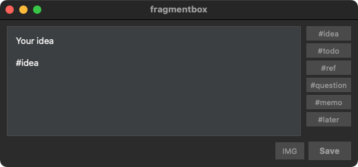
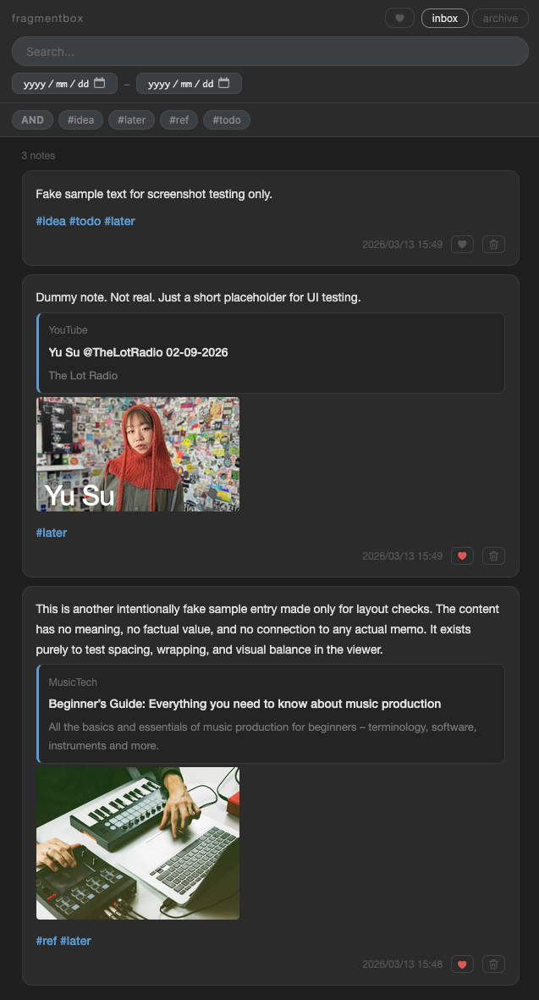

# fragmentbox

思いついたことをすぐにメモしてローカルに保存できる、シンプルなパーソナルメモツール。

[English README](README.md)

## 概要

fragmentbox は2つのコンポーネントで構成されています。

- **fragmentbox.py** — メモをすばやく書いて保存する GUI（PySide6）
- **viewer.py** — 保存されたメモをブラウザで一覧・検索する Web ビューア（FastAPI）

## 対応プラットフォーム

- macOS
- Linux

## 必要環境

- Python 3.12+
- [libvips](https://www.libvips.org/)（画像圧縮に使用）

  ```bash
  # macOS
  brew install vips

  # Ubuntu / Debian
  sudo apt install libvips
  ```

## セットアップ

```bash
# 仮想環境の作成と有効化
python -m venv .venv
source .venv/bin/activate

# 依存関係のインストール
pip install -e .
```

## 使い方

### メモを書く



起動スクリプト `run_fragmentbox.sh` を作成して実行します（後述の「起動スクリプトの作成」を参照）。

```bash
./run_fragmentbox.sh
# デバッグログを出したいとき
FRAGMENTBOX_LOG=DEBUG ./run_fragmentbox.sh
```

- テキストエリアにメモを入力し、保存ショートカットで保存
  - macOS: `Cmd+S` / `Cmd+Return` / `Ctrl+Return`
  - Linux: `Ctrl+S` / `Ctrl+Return`
- 保存先は `config.toml` で設定できます（1 保存 = 1 Markdown ファイル、ファイル名は日時）
- 右側のタグボタンを押すと本文末尾にタグを挿入（タグは `config.toml` の `[tags]` セクションで管理）
- テキスト内の URL は保存時にメタデータ（タイトル・サイト名・説明・サムネイル）を自動取得して挿入
  - 一般 URL: trafilatura を使用
  - YouTube URL: yt-dlp を使用
- 画像ファイルをドラッグ＆ドロップ、または「IMG」ボタンで選択してフラグメントに添付
  - ラスター画像は WebP に変換して `assets/` フォルダへ保存
  - SVG / GIF はそのままコピー

### メモを閲覧する



```bash
python viewer.py
```

サーバーが起動し、ブラウザが自動的に開きます（ポート: `8765`）。

**ビューア機能:**

- Inbox / Archive タブ切り替え
- テキスト検索（リアルタイム）
- タグ絞り込み（複数選択・AND/OR 切り替え）
- 日付範囲フィルタ
- お気に入りのトグル（`#favorite` タグの付け外し）
- メモの削除（Inbox のみ。`config.toml` で設定した Trash フォルダへ移動。添付画像も同時移動）

終了するにはターミナルで `Ctrl+C` を押します。

## 起動スクリプトの作成

`run_fragmentbox.sh` はローカル環境依存のため Git に含まれていません。以下を参考にプロジェクトルートに作成し、`chmod +x` で実行権限を付与してください。

```bash
#!/bin/bash
SCRIPT_DIR="$(cd "$(dirname "$0")" && pwd)"
cd "$SCRIPT_DIR" || exit 1

if [[ "$(uname)" == "Darwin" ]]; then
  export DYLD_LIBRARY_PATH="/opt/homebrew/lib:/usr/local/lib:$DYLD_LIBRARY_PATH"
fi

source .venv/bin/activate
python fragmentbox.py
```

macOS では libvips のために `DYLD_LIBRARY_PATH` を設定しています。libvips のインストール先に合わせて、各自の環境でパスを変更してください。

## ファイル構成

```
fragmentbox/
├── fragmentbox.py   # GUI クライアント
├── viewer.py        # FastAPI サーバー
├── viewer.html      # ビューア フロントエンド
├── css/
│   └── viewer.css   # スタイルシート
├── config.toml      # パス・ポート・タグ・画像設定
└── pyproject.toml
```

## 設定

`config.toml` でパスとポートを変更できます。

```toml
[paths]
inbox   = "~/idea_pool/fragmentbox/inbox"
archive = "~/idea_pool/fragmentbox/archive"
trash   = "~/idea_pool/fragmentbox/Trash"
assets  = "~/idea_pool/fragmentbox/assets"

[viewer]
port = 8765

[tags]
presets = ["idea", "todo", "ref", "question", "memo", "later"]

[images]
quality = 80  # WebP 変換時の品質 (1-100)
```

## データの保存場所

inbox / archive / trash / assets のパスはすべて `config.toml` の `[paths]` セクションで設定します。

## License

MIT
