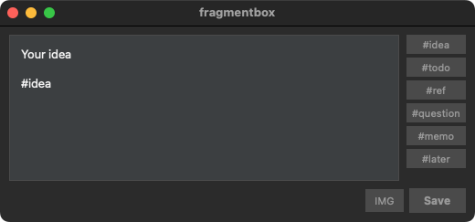
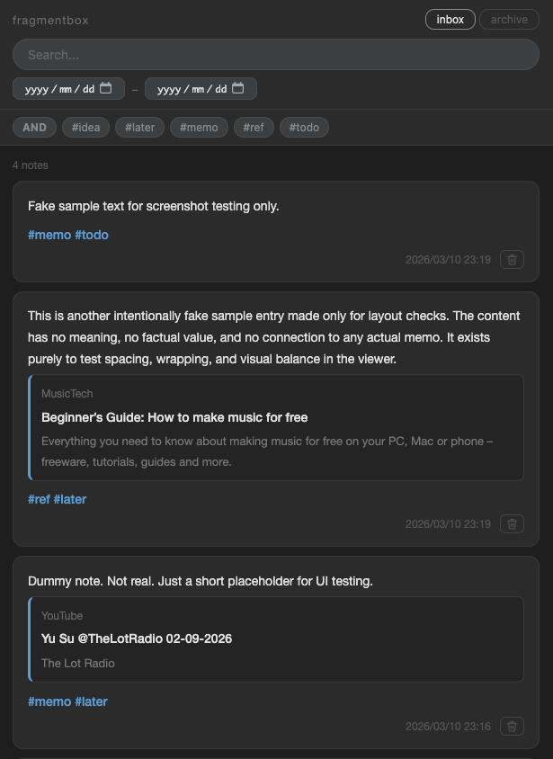

# fragmentbox

A simple personal note-taking tool to quickly capture ideas and save them locally.

[日本語 README](README-ja.md)

## Overview

fragmentbox consists of two components:

- **fragmentbox.py** — A GUI (PySide6) for quickly writing and saving notes
- **viewer.py** — A web viewer (FastAPI) for browsing and searching saved notes

## Documentation and Planned Changes

The viewer supports displaying, creating, and reordering physical folders. The posting GUI still saves to the Inbox. The bottom composer saves to the selected folder. The archive action in each article’s three-dot menu preserves its folder when archiving. Archived articles can be restored to their original folder using the restore button. Active articles can be moved using a searchable folder picker.

The workflow archives finished notes manually, preserving their original content and folder membership while removing them from the normal view. Periodic AI summarization or rewriting is not a prerequisite.

- [SPEC.md](SPEC.md) (Japanese): Sections 2–10 record the previous behavior, section 11 describes the planned direction, and sections 12–13 document the folder and posting features and changes to current behavior.
- [spec_post.md](spec_post.md) / [spec_viewer.md](spec_viewer.md) (Japanese): Historical requirements for the previous workflow.

## Supported Platforms

- macOS
- Linux

## Requirements

- Python 3.12+

## Setup

```bash
# Create and activate a virtual environment
python -m venv .venv
source .venv/bin/activate

# Install dependencies
pip install -e .
```

## Usage

### Capture a note



Create and run the launch script `run_fragmentbox.sh` (see "Creating the Launch Script" below).

```bash
./run_fragmentbox.sh
# To enable debug logging
FRAGMENTBOX_LOG=DEBUG ./run_fragmentbox.sh
```

- Type a note in the text area and save with a keyboard shortcut
  - macOS: `Cmd+S` / `Cmd+Return` / `Ctrl+Return`
  - Linux: `Ctrl+S` / `Ctrl+Return`
- The save location can be configured in `config.toml` (one Markdown file per note, filename is a timestamp)
- Click a tag button on the right to append a tag to the note (tags are managed in the `[tags]` section of `config.toml`)
- URLs in the text have their metadata (title / site name / description / thumbnail) automatically fetched and inserted on save
  - General URLs: uses trafilatura
  - YouTube and Reddit post URLs: use their respective oEmbed APIs
- Attach images by drag & drop or via the "IMG" button
  - Raster images are converted to WebP and saved in the `assets/` folder
  - SVG / GIF files are copied as-is

### Browse notes



```bash
python viewer.py
```

The server starts and a browser window opens automatically (port: `8765`).

**Viewer features:**

- Show Inbox alongside normal folders in the left pane, with Archive in a separate area
- Real-time text search
- Tag filtering (multiple selection, AND/OR toggle)
- Date range filter
- Toggle favorite (add/remove the `#favorite` tag) / filter to show favorites only
- Edit notes (normal folders, Inbox, and Archive; edit inline using the pencil icon on an article)
- Permanently delete notes from normal folders or Inbox after confirmation, including referenced images unused by other articles

Press `Ctrl+C` in the terminal to stop the server.

## Creating the Launch Script

`run_fragmentbox.sh` is not included in the repository because it depends on the local environment. Create it in the project root using the template below and make it executable with `chmod +x`.

```bash
#!/bin/bash
SCRIPT_DIR="$(cd "$(dirname "$0")" && pwd)"
cd "$SCRIPT_DIR" || exit 1

source .venv/bin/activate
python fragmentbox.py
```

## File Structure

```
fragmentbox/
├── fragmentbox.py   # GUI client
├── viewer.py        # FastAPI server
├── viewer.html      # Viewer frontend
├── css/
│   └── viewer.css   # Stylesheet
├── config.toml      # Path, port, tag, and image settings
└── pyproject.toml
```

## Configuration

Edit `config.toml` to change paths and the port.

```toml
[paths]
root    = "~/idea_pool/fragmentbox"
active  = "~/idea_pool/fragmentbox/active"
inbox   = "~/idea_pool/fragmentbox/active/inbox"
archive = "~/idea_pool/fragmentbox/archive"
assets  = "~/idea_pool/fragmentbox/assets"

[viewer]
port = 8765

[tags]
presets = ["idea", "todo", "ref", "question", "memo", "later"]

[images]
quality = 80  # WebP conversion quality (1-100)
```

## Folder Operations

- A new session starts in inbox. Reloading the same tab preserves the selected folder. Inbox and created folders appear together in a vertical list. There is no notes item.
- Click `+` at the top, enter a name, and press Enter or 「作成」 to create a folder. Use 「取消」 or Escape to close the form.
- Click a folder name to view its notes.
- Drag and drop names to reorder them. With a name focused, use `Alt + ↑ / ↓` to reorder by keyboard. The order persists across restarts.
- New folders occupy one level directly under `paths.active`. Inbox can be reordered and posted to like any other folder. Archive appears separately; the normal folder list remains visible.
- Display order, including Inbox, is saved in `.navigation-order.json` under `paths.active`. Existing Markdown files are not migrated.

- Right-click a normal folder to rename or delete it. Inbox is excluded.
- Renaming also renames the matching Archive folder, retaining order and selection. Existing destination folders in either location cause an error rather than a merge.
- Folders can be deleted with articles inside. Confirm the name and article count before permanent deletion. Matching Archive folders remain. Changes since confirmation require a fresh confirmation; non-article files or subfolders prevent deletion.
- Trash is no longer used. There is no deletion history or in-app undo. Existing Trash data is not modified automatically.

## Organizing and Viewing Articles

- Articles appear oldest first, with newer articles at the bottom. A folder opens at the bottom on its first visit; switching back restores its previous scroll position. Reloading resets scroll positions.
- Open the three-dot menu and choose 「別のフォルダへ移動」 to select a destination. Search by folder name, then click a folder or use `↑ / ↓` and Enter to move. Esc or a click outside closes the picker. Candidates follow the sidebar order and include Inbox, excluding the current folder and Archive. Archived articles have no move action.
- The archive menu action moves `active/folder/article.md` to `archive/folder/article.md`. In Archive, the restore icon returns the article to the same folder name, creating that folder if needed.
- Moving, archiving, and restoring preserve filenames, content, and timestamps. Images remain in shared `assets`, and relative links stay unchanged. A filename collision reports an error and leaves the original article in place without overwriting anything.
- Editing happens inline. Link previews remain cards with an × removal button. Save applies changes and permanently deletes removed thumbnails only when no other articles reference them. Cancel discards changes.
- Corrected image references display 「リンク補正あり」 with an adjacent `fix` button. Use it to repair correctable references in the Markdown file. Missing images produce a warning and are not automatically repaired.

## Tag Operations

- Search the tag list by partial name. Selected tags remain visible.
- Right-click a tag to rename it across the selected folder and its matching Archive folder. Save or cancel edits in those folders first.
- Type `#` in the composer or inline editor to suggest tags from the current folder. Use arrows to select, Enter or click to accept, and Esc to dismiss.
- Clearing tag filters, toggling favorites, and entering edit mode preserve the visible article position.
- Once the tag list scrolls out of view, scrolling up 24px reveals it and scrolling down 300px hides it. It slides under the header in 180ms without shifting the article layout.

## Link Previews

Titles prioritize Open Graph, Twitter metadata, then HTML titles. The source URL appears above the card as a clickable link. Multiple images are deduplicated, saved, and displayed in two columns. Display cropping does not alter the saved image.

Links added during editing fetch metadata on Save. Failed retrieval preserves the text and shows a warning. Existing link cards are not automatically fetched again.

## Post from the Viewer

Select a folder in the left pane, write in the bottom composer, and click Save. The destination appears above the text area. Successful posts clear the composer and refresh the list. Posting to Archive is disabled.

- Tags appear horizontally below the text area. Presets come from `config.toml` and append to the text without duplicates.
- Attach images using IMG or file drag and drop. Multiple files are supported, up to 20 MiB each. Raster images become WebP; SVG/GIF retain their format.
- Saving fetches URL titles, site names, descriptions, and thumbnails. Failed metadata retrieval produces a warning while preserving the saved text.
- Within the composer, use Cmd+S / Cmd+Return / Ctrl+Return on macOS, or Ctrl+S / Ctrl+Return elsewhere.
- Input and folder switching are disabled during saving or attachment. Failures preserve the draft, and switching folders also retains it.
- Images are stored when attached, so abandoning a post leaves unreferenced images.

## Data Storage

All paths for root, active, inbox, archive, and assets are configured in the `[paths]` section of `config.toml`.

## License

MIT
